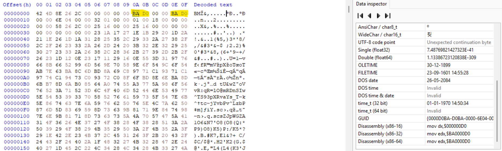
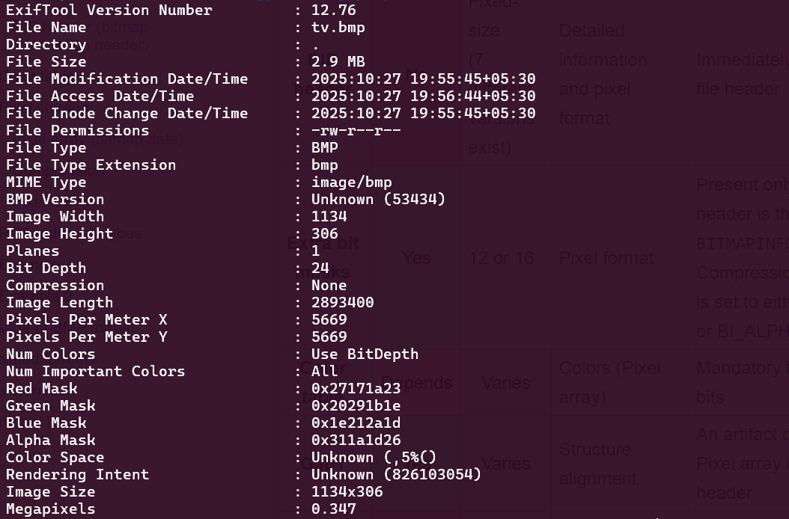
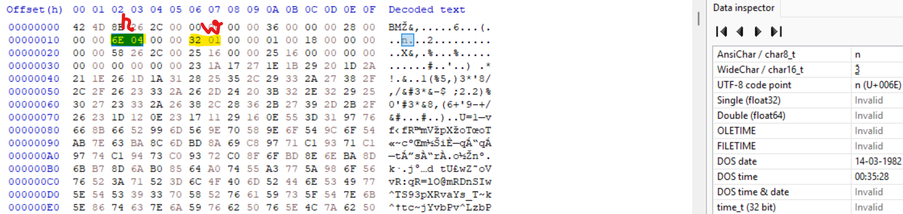
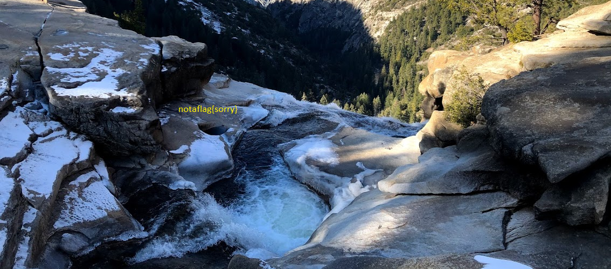
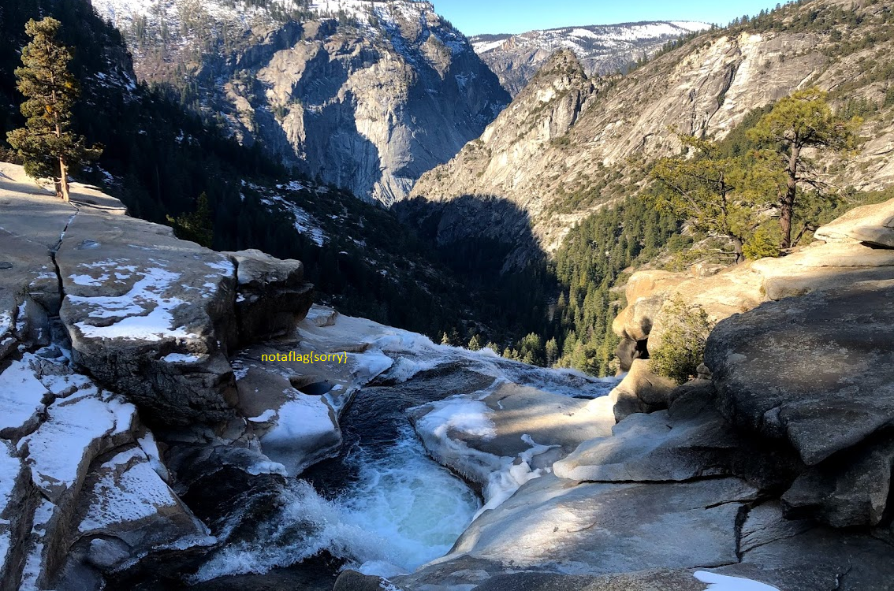
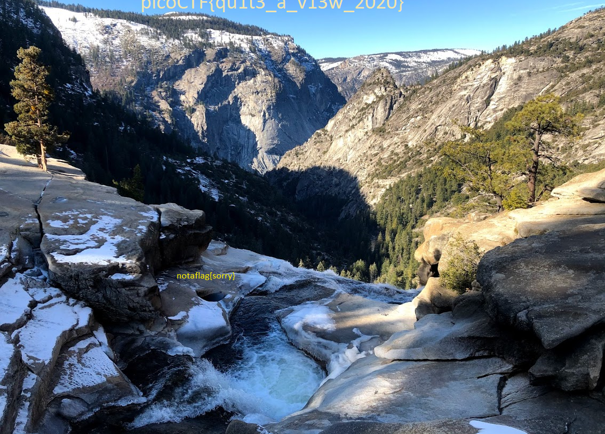
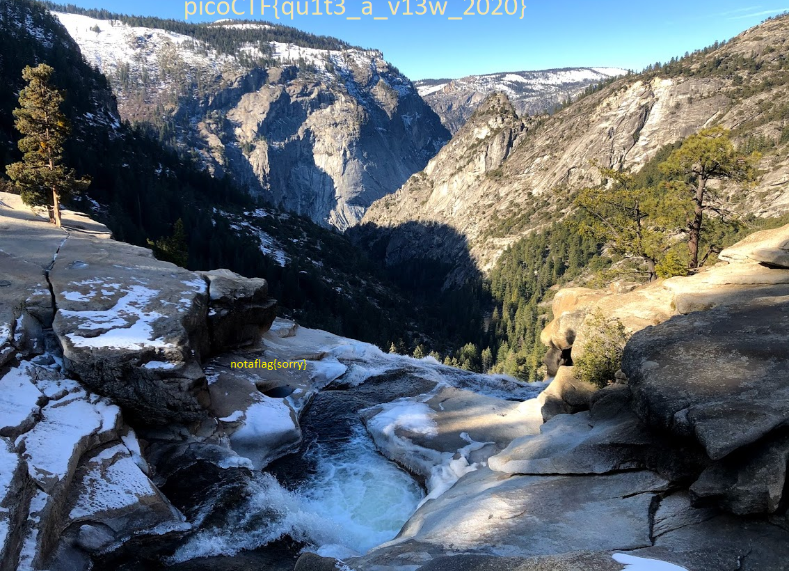
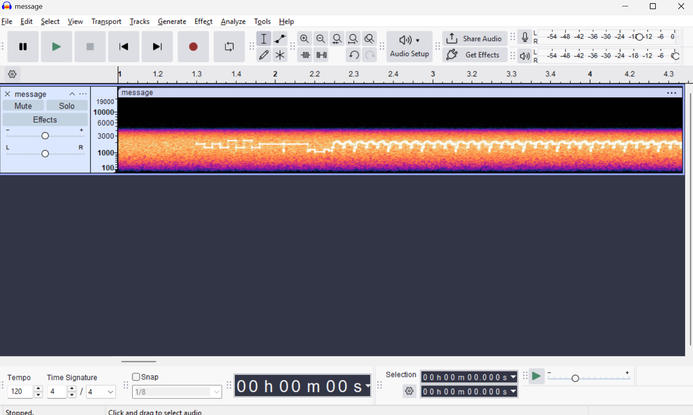
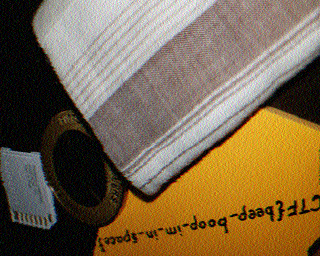

# Forensics

## 1. Trivial Flag Transfer Protocol

### My Solution

The challenge is to extract data from the given pcap-ng file to get the flag

- [pcap-ng file](./tftp/tftp.pcapng)

**Flag:**`picoCTF{h1dd3n_1n_pLa1n_51GHT_18375919}`

**Steps:**

- First I opened up the given file in wireshark
- Then I exported the TFTP objects from wireshark to get `instructions.txt`, `plan`, `picture1.bmp`, `picture2.bmp`, `picture3.bmp`, `program.deb`

> _instruciton.txt_
```text
GSGCQBRFAGRAPELCGBHEGENSSVPFBJRZHFGQVFTHVFRBHESYNTGENAFSRE.SVTHERBHGNJNLGBUVQRGURSYNTNAQVJVYYPURPXONPXSBEGURCYNA
```

- After decoding this cipher-text using ROT13 we get

```text
TFTPDOESNTENCRYPTOURTRAFFICSOWEMUSTDISGUISEOURFLAGTRANSFER.FIGUREOUTAWAYTOHIDETHEFLAGANDIWILLCHECKBACKFORTHEPLAN
```

> _plan_
```text
VHFRQGURCEBTENZNAQUVQVGJVGU-QHRQVYVTRAPR.PURPXBHGGURCUBGBF
```

- Again using ROT13 decoding gives us

```text
IUSEDTHEPROGRAMANDHIDITWITH-DUEDILIGENCE.CHECKOUTTHEPHOTOS
```

> _program.deb_

- By analysing the `program.deb` file we can see that it is the same as the steghide bin (running `apt-get install` for the file)

```bash
$ sudo apt-get install ./program.deb
Reading package lists... Done
Building dependency tree... Done
Reading state information... Done
Note, selecting 'steghide' instead of './program.deb'
Some packages could not be installed. This may mean that you have
requested an impossible situation or if you are using the unstable
distribution that some required packages have not yet been created
or been moved out of Incoming.
The following information may help to resolve the situation:

The following packages have unmet dependencies:
 steghide : Depends: libjpeg62-turbo (>= 1:1.3.1) but it is not installable
E: Unable to correct problems, you have held broken packages.
```

- Now according to the program and above texts we can discern that steghide was used to hide some data inside of the images using the passkey DUEDILIGENCE. So I tried to run `steghide extract` for the three images obtained

> _picture1.bmp_


```bash
$ steghide extract -sf picture1.bmp -p DUEDILIGENCE
steghide: could not extract any data with that passphrase!
```

> _picture2.bmp_


```bash
$ steghide extract -sf picture2.bmp -p DUEDILIGENCE
steghide: could not extract any data with that passphrase!
```

> _picture3.bmp_


```bash
$ steghide extract -sf picture3.bmp -p DUEDILIGENCE
wrote extracted data to "flag.txt".
```

- Finally, I read the `flag.txt` file to get the flag

```bash
$ cat flag.txt
picoCTF{h1dd3n_1n_pLa1n_51GHT_18375919}
```

## 2. tunn3l v1s10n

### My Solution

The challenge is to extract data from the given file and get flag. File given is:

- [tunn3l_v1s10n](./tunn3lv1s10n/tunn3l_v1s10n)

**Flag:**`picoCTF{qu1t3_a_v13w_2020}`

**Steps:**

- First I ran the `file` command on the given file 

```bash
$ file tunn3l_v1s10n
tunn3l_v1s10n: data
```

- Then I thought of checking the header of the given file and used the `xxd` command to do so

```bash
$ xxd tunn3l_v1s10n | head
00000000: 424d 8e26 2c00 0000 0000 bad0 0000 bad0  BM.&,...........
00000010: 0000 6e04 0000 3201 0000 0100 1800 0000  ..n...2.........
00000020: 0000 5826 2c00 2516 0000 2516 0000 0000  ..X&,.%...%.....
00000030: 0000 0000 0000 231a 1727 1e1b 2920 1d2a  ......#..'..) .*
00000040: 211e 261d 1a31 2825 352c 2933 2a27 382f  !.&..1(%5,)3*'8/
00000050: 2c2f 2623 332a 262d 2420 3b32 2e32 2925  ,/&#3*&-$ ;2.2)%
00000060: 3027 2333 2a26 382c 2836 2b27 392d 2b2f  0'#3*&8,(6+'9-+/
00000070: 2623 1d12 0e23 1711 2916 0e55 3d31 9776  &#...#..)..U=1.v
00000080: 668b 6652 996d 569e 7058 9e6f 549c 6f54  f.fR.mV.pX.oT.oT
00000090: ab7e 63ba 8c6d bd8a 69c8 9771 c193 71c1  .~c..m..i..q..q.
```

- This tells me that the given file could be a BMP (bitmap) image

- So I renamed the file to `tv.bmp`, but I wasn't able to open it normally (the BMP file is corrupted so we have to repair it)

- I went and checked the structure of BMP files up on `wikipedia`

- Then I opened the file up in Hex Editor and identified the bad values



- Now these bytes are supposed to be `36 00` and `28 00` respectively as the first value represents offset from where the image data of the bmp starts which should be `54` (14 for BMP file header + 40 for DIB header or the windows BITMAPINFO header) which is `0x36` and the second value represents the size of the windows BITMAPINFO header which should be `40` which is `0x28`

- Doing the necessary changes gives us the following image


- Now we still aren't able to see the flag so I ran the `exiftool` command on the bmp file to get the current size of the image

```bash
$ exiftool tv.bmp
```


- Now I searched for the hex value of the image height and width in the Hex Editor to find the bytes that set it



- In the above image, the bytes that have been marked with `w` control the height and those marked with `h` control the width

- I had made a mistake while trying this for the first time and realised that it needed a fix

- Increasing the width was leading in a file so obscure that I couldn't discern anything so I started experimenting with the height

- First I tried increasing the height to `1000` or `0x3e8` or `E8 03` which leads in a corrupted file

- Next I tried changing the height to `500` or `0x14f` or `4F 01` which leads to a file where the flag is not visible



- Next I tried the same for `750` or `0x2ee` or `EE 02` which leads to a file where again no flag is visible



- Next I tried the same for `875` or `0x36b` or `6B 03` which leads to a file that is corrupted

- Next I tried to set the height as `815` or `0x32f` or `2F 03` and got a glimpse of the flag



- Finally setting the height to `820` or `0x334` or `34 03` gave me the flag



### References
[BMP file format wiki](https://en.wikipedia.org/wiki/BMP_file_format)

## 3. m00nwalk

### My Solution

The challenge is to decode the given message and get the flag. File given is:

- [message.wav](./m00nwalk/message.wav)

**Flag:**`picoCTF{beep_boop_im_in_space}`

**Steps:**

- My first step was to open up this wav file in audacity and check it's spectogram which looks something like this 



- The pattern we can see is not of general encoding methods such as DTMF tones or Morse Code

- I wasn't able to discern what type of encoding this is so, I took a hint and that was `how did pictures from moon landing get sent to Earth?` and when I googled this I got the answer to be `SSTV Telecast` (Slow-Scan Television Telecast)

- Next I used an online decoder to decode the SSTV signal and got an image which has the flag in it



### Notes

- While stumbling around in this challenge I learned about some cool utilities such as `multimon-ng` and `minimodem`
- The SSTV Mode is Scottie2

### References

- [multimon-ng and minimodem demo](https://www.youtube.com/watch?v=tKNNnbgoGdI)
- [Modulation Types](https://www.youtube.com/watch?v=c3eMoHuPRy0)
