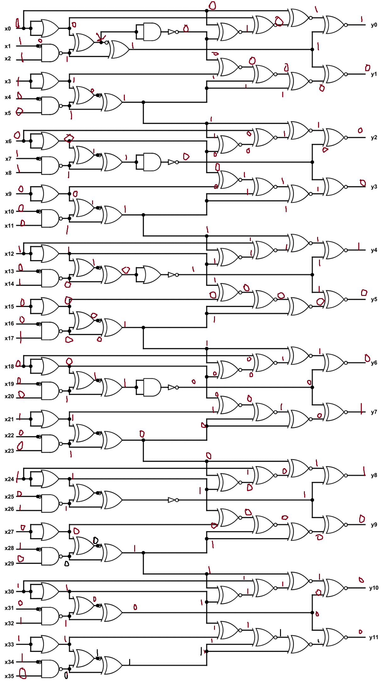
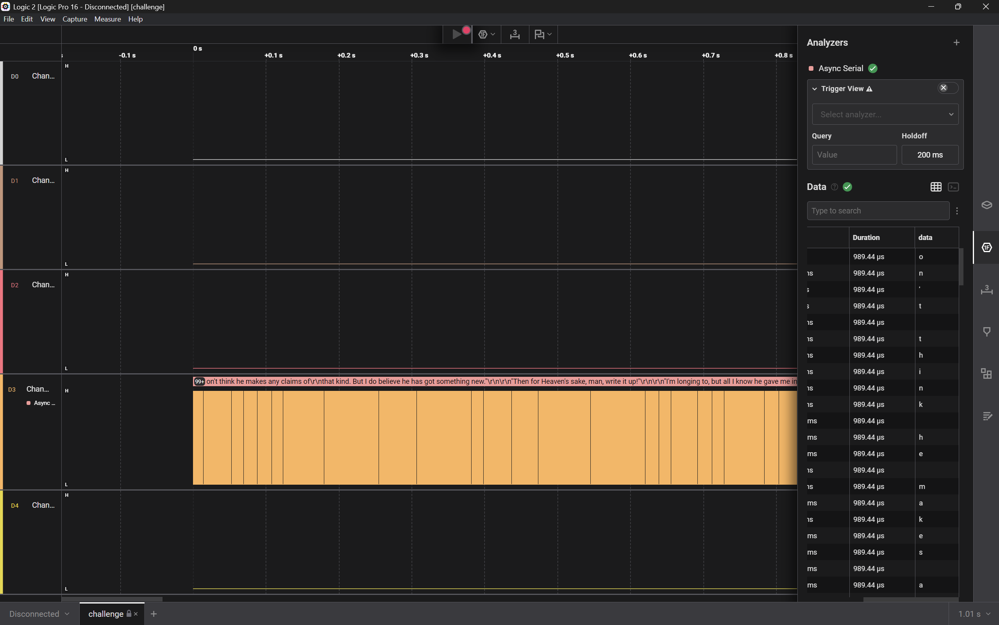
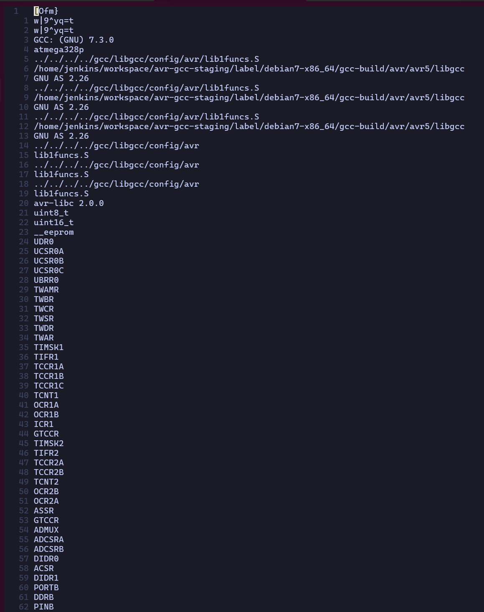
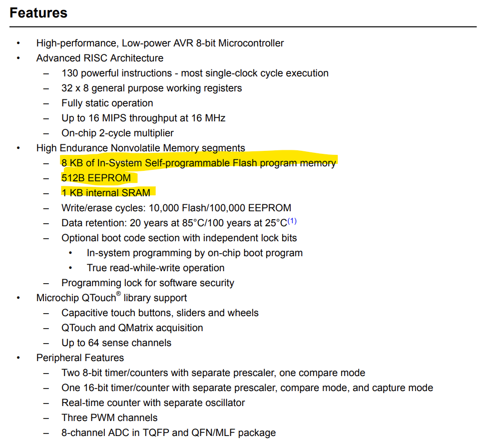

# Hardware

## 1. IQ Test
The challenge is basically to convert the given `Logic Gates circuit` and get the output from it

Challenge Files:
- [desc.txt](./iq-test/desc.txt)
- [iqtest.png](./iq-test/iqtest.png)

> from desc: x = 30478191278

> flag format given in `desc` file

### My Solve

**Flag:**`nite{100010011000}`

**Steps:**
- I converted the given input to binary and solved the gates image as follows for the given input

```text
x = 0b11100011000101001000100101010101110
```



- Now, my output becomes `100010011000`

- Then I wrapped the output inside `nite{` and `}` to get the flag

## 2. I Like Logic
The challenge is to find out what `logic` and `files` have in common and get the flag according to the challenge description

Challenge Files:
- [desc.txt](./i_like_logic/desc.txt)
- [iqtest.png](./i_like_logic/challenge.sal)

### My Solve

**Flag:**`FCSC{b1dee4eeadf6c4e60aeb142b0b486344e64b12b40d1046de95c89ba5e23a9925}`

**Steps:**
- My first step was to run `file` command on the `challenge.sal` file

```bash
$ file challenge.sal
challenge.sal: Zip archive data, at least v2.0 to extract, compression method=deflate
```

- Next I went and read about the `.sal` file extensions and got to know that these are typically `Saleae Logic capture files` so I installed `Saleae Logic 2` software and opened the file in it

- Next I added an async analyser on channel 3 (kept the settings as default), used the `Baud rate estimate` extension to estimate baud rate (transmission rate in baud/s) and got some data

- And then I switched to ASCII mode to make the data readable



- Then Instead of the data table, I switched to the terminal mode and was able to see the data as a complete chunck where I found the flag

```text
...
"Challenger's sketch-book."

"You think he drew that animal?"

"Of course he did.  Who else?"

"Well, then, the photographs?"

"There was nothing in the photographs.  By your own admission you only
saw a bird."

FCSC{b1dee4eeadf6c4e60aeb142b0b486344e64b12b40d1046de95c89ba5e23a9925}

"A pterodactyl."

"That's what HE says.  He put the pterodactyl into your head."

"Well, then, the bones?"

"First one out of an Irish stew.  Second one vamped up for the
occasion.  If you are clever and know your business you can fake a bone
as easily as you can a photograph."
...
```

### Notes

> Some Cool Things About This Chal

- The excerpt around the flag is from `The Lost World` by `Sir Arthur Connon Doyle`
- The signal is a UART signal (Univarsal Asynchronous Reciever/Transmitter signal) and it can be used in Embedded Systems, Data Logging, and more

> Different method I though of approaching this chal and will try 

- Opening the chal file up as a zip 
- Using python to use Logic 2 rather than the GUI

I also learnt about serial communication protocols through the following resource: [serial comms protocol](https://www.youtube.com/watch?v=IyGwvGzrqp8)

## 3. Bare Metal Alchemist
This challenge gives us a firmware and we have to figure out the flag from it

Challenge Files:
- [desc.txt](./bare-metal-alchemist/desc.txt)
- [firmware.elf](./bare-metal-alchemist/firmware.elf)

### My Solve

**Flag:**``

**Steps:**
- My first step was to run `file` command on the `firmware.elf` file

```bash
$ file firmware.elf
firmware.elf: ELF 32-bit LSB executable, Atmel AVR 8-bit, version 1 (SYSV), statically linked, with debug_info, not stripped
```

- From this we can discern that this is an `ELF` file (also apperent from the extension but the extension can be changed so this confirms it) and is made for an `Atmel AVR 8-bit Microcontroller`

- Then I ran `strings` on it to see if I can spot the flag there

```bash
$ strings firmware.elf
```



- This didn't help me so, I went on the net to check how data is stored in Atmel AVR 8-bit firmware and saw that it is generally stored in 3 places: EEPROM, FLASH Memory and SRAM



- For all intensive purposes we can remove SRAM from the discussion as it is for variables or data generated on runtime of the firmware

- And the pattern of how flag will be stored could be through `lightweight obfuscation` as we couldn't find it as plaintext

- My next step was to look for lightweight obfuscations that could be used and I found that it could be stored through XOR so I tried to reverse that

- So I wrote a python script to brute force XOR the data and check it with a general flag format

> _soln.py_
```python
import re

data = open("firmware.elf", "rb").read()
p = re.compile(rb"[A-Za-z0-9_]{1,20}\{[A-Za-z0-9_\-\+\=\/\\\.\s]{10,200}\}")

for k in range(1, 256):
    decoded = bytes(b ^ k for b in data)
    match = p.search(decoded)
    if match:
        print("Key:", k, "Flag:", match.group().decode())
```

- Then I ran the script to get the flag

```bash
$ python3 soln.py
Key: 11 Flag: yjf{dgbenxTneo
                            TT}
Key: 57 Flag: 9mnxtk9mn{k9mnzk9mnjk9mn}
Key: 66 Flag: HBB{vBALxIyI
                          Q}
Key: 107 Flag: mzjyjhcpcNcxnkkkjzk{mzjyjhcpcNcxnkkk}
Key: 165 Flag: TFCCTF{Th1s_1s_som3_s1mpl3_4rdu1no_f1rmw4re}
```

### References

[Atmel AVR 8-bit DataSheet](https://ww1.microchip.com/downloads/en/DeviceDoc/en590320.pdf)

