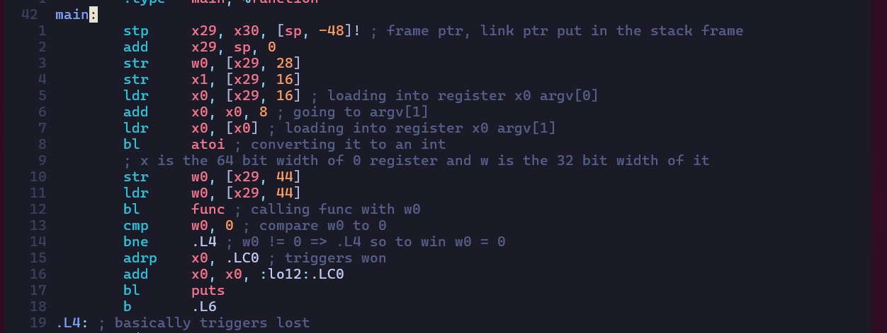
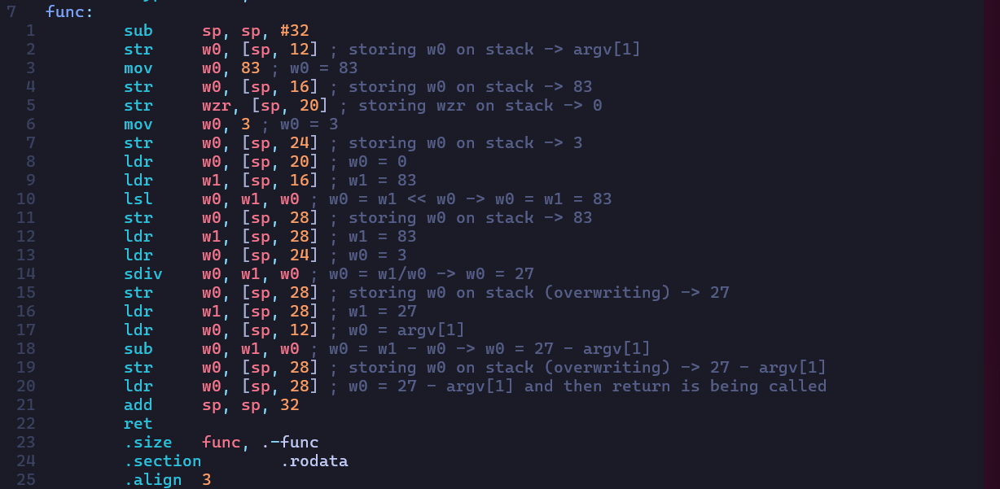

# Reverse Engineering

## 1. GDB baby step 1

The challenge is to figure out what is in the `eax` register at the end of the main function 

Flag layout: `picoCTF{base10(n)}` where `n` is the value in `eax` register

Challenge Files:
- [debugger0_a](./GDBbs1/debugger0_a)

### My Solution

**Flag:**`picoCTF{549698}`

**Steps:**

- My frist step was to open up the binary with GDB

```bash
$ gdb debugger0_a
```

- Next step was to check all defined functions using `info func` in gdb

```bash
(gdb) info func
All defined functions:

Non-debugging symbols:
0x0000000000001000  _init
0x0000000000001030  __cxa_finalize@plt
0x0000000000001040  _start
0x0000000000001070  deregister_tm_clones
0x00000000000010a0  register_tm_clones
0x00000000000010e0  __do_global_dtors_aux
0x0000000000001120  frame_dummy
0x0000000000001129  main
0x0000000000001140  __libc_csu_init
0x00000000000011b0  __libc_csu_fini
0x00000000000011b8  _fini
```

- Next I disassembled `main` function

```bash
(gdb) disas main
Dump of assembler code for function main:
   0x0000000000001129 <+0>:     endbr64
   0x000000000000112d <+4>:     push   %rbp
   0x000000000000112e <+5>:     mov    %rsp,%rbp
   0x0000000000001131 <+8>:     mov    %edi,-0x4(%rbp)
   0x0000000000001134 <+11>:    mov    %rsi,-0x10(%rbp)
   0x0000000000001138 <+15>:    mov    $0x86342,%eax
   0x000000000000113d <+20>:    pop    %rbp
   0x000000000000113e <+21>:    ret
End of assembler dump.
```

- Here we can see that the value `0x86342` is being moved into the `eax` register near the end of main function

- The base10 value becomes `549698` and hence the flag becomes `picoCTF{549698}`

## 2. ARMssembly 1

The challenge is to figure out for what argument does this program print `win` with variables `83`, `0` and `3` 

Flag layout: `picoCTF{XXXXXXXX}`  (XXXXXXXX -> hex, lowercase, no 0x, and 32 bits)

Challenge File
- [chall_1.S](./ARMassembly1/chall_1.S)

### My Solution

**Flag:**`picoCTF{0000001b}`

**Steps:**

- My first step was to analyse the assembly file give to us
    - The architechtre being used is 64-bit arm assembly
    - Then I analysed the main function and commented what each instruction was doing
    
    - Similarly I analysed the func function which was being called from the main function
    
    - What we want to do here is call `.L0`, to do which we need `w0` to store the value `0` when comparision is being carried out in the main function, to do this we must pay attention to the func function where the value of `w0` is being altered at the end of this function the following is being set `w0 = 27 - argv[1]` so our `argument` needs to be `27` to set `w0` to `0` and in-turn get the win

- Finally, I converted `27` to hex which is `0x0000001b` and modified this value according to the given flag layout to get the flag

## 3. vault-door-3

The challenge is to find the password to the vault door

Challenge File
- [VaultDoor3.java](./vaultdoor3/VaultDoor3.java)

### My Solution

**Flag:**`picoCTF{jU5t_a_s1mpl3_an4gr4m_4_u_1fb380}`

**Steps:**

- We are directly given the source code for the password checker, so I directly started with the analysation of the `VaultDoor3.java` file
    - If the password string after some modification inside the `checkPassword` function is equal to `jU5t_a_sna_3lpm18gb41_u_4_mfr340` then the string is correct. So, we just need to reverse the modification being done inside this function
    - first check is for the length of the password which should be 32
    - for the first 8 characters of the password no modification is being done
    - for the next 8 characters the characters being picked up are from indexes `23-8` to `23-15` respectively which means that the substring is being reversed
    - for the next 8 characters the characters are being picked up from index `30` to `16` respectively and also the every other character is being skipped
    - for the next 8 characters the characters are being picked up from index `31` to `17` respectively skipping every other character

- Next I just used python3 to get password

```bash
$ python3
```

```python
>>> s = 'jU5t_a_sna_3lpm18gb41_u_4_mfr340'
>>> o = list(range(32))
>>> o
[0, 1, 2, 3, 4, 5, 6, 7, 8, 9, 10, 11, 12, 13, 14, 15, 16, 17, 18, 19, 20, 21, 22, 23, 24, 25, 26, 27, 28, 29, 30, 31]
>>> for i in range(0,8):
...     o[i] = s[i]
...
>>> for i in range(8, 16):
...     o[i] = s[23 - i]
...
>>> for i in range(16, 32, 2):
...             o[46-i] = s[i]
...
>>> for i in range(31, 16, -2):
...             o[i] = s[i]
...
>>> ''.join(o)
'jU5t_a_s1mpl3_an4gr4m_4_u_1fb380'
```

- Finally, I wrapped this password in picoCTF to get the flag or the final password string

