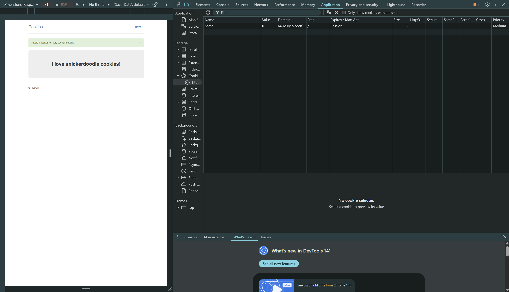

# Web Exploitation

## 1. Web Gauntlet

The challenge is to beat the filters and perform SQLi

Challenge Endpoints: `sign-in page` and `filter page` (dynamically generated when clicked on Launch Instance)

### My Solution

**Flag:**`picoCTF{y0u_m4d3_1t_79a0ddc6}`

**Round 1:**
- The filters
    - `or`
- On testing, the query expected to run is:
```sql
SELECT * FROM users WHERE username='admin' AND password='asdf'
```
- SQLi payload instead of Username: `admin' --`

**Round 2:**
- The filters
    - `or`
    - `and`
    - `like`
    - `=`
    - `--`
- SQLi payload instead of Username: `admin' /*`

**Round 3:**
- The filters
    - `or`
    - `and`
    - `like`
    - `=`
    - `--`
    - `>`
    - `<`
- SQLi payload instead of Username: `admin';`

**Round 4:**
- The filters
    - `or`
    - `and`
    - `like`
    - `=`
    - `--`
    - `>`
    - `<`
    - `admin`
- SQLi payload instead of Username: `a'||'dmin';`

**Round 5:**
- The filters
    - `or`
    - `and`
    - `like`
    - `=`
    - `--`
    - `>`
    - `<`
    - `admin`
    - `union`

- SQLi payload instead of Username: `a'||'dmin';`

Completing all the rounds gives us the flag 

## 2. SSTI1

The challenge is to use SSTI (Server Side Template Injection) to get the flag

Challenge Endpoint: `an announcement website` (generated dynamically when Launch Instance is clicked)

### My Solution

**Flag:**`picoCTF{s4rv3r_s1d3_t3mp14t3_1nj3ct10n5_4r3_c001_4675f3fa}`

**Steps:**

- I opened up the given challenge endpoint in burp suite and edited the request being sent to send different payloads using the `Intruder` tab


- Then I checked the responses for these payloads and for the payload `{{7*7}}` we see that content being sent is `49` which means we have found our vulnurability


- Then I checked the response for a new payload `{{7*'7'}}` and found it to be `7777777` this confirms that the website is using `jinja2 (python)`

- Then I searched for jinja2 templates on the web to get an idea of what I could do with it

- Finally, I used the payload `{{ self._TemplateReference__context.cycler.__init__.__globals__.os.popen('cat flag').read() }}` to get the flag


### References
- [ssti payloads](https://www.intigriti.com/researchers/blog/hacking-tools/exploiting-server-side-template-injection-ssti)
- [jinja2 templates](https://jinja.palletsprojects.com/en/stable/templates/)

## 3. Cookies

The challenge is to figure out the best cookie

Challenge Endpoint: [http://mercury.picoctf.net:54219/](http://mercury.picoctf.net:54219/)

### My Solution

**Flag:**`picoCTF{3v3ry1_l0v3s_c00k135_96cdadfd}`

**Steps:**

- I opened up the challenge endpoint and with it the chrome dev tools `Application` tab and we see a cookie named `name` in the cookies section of the application tab

- The value of this cookie is set to `-1` by default


- Next I tried to enter `snickerdoodle` as my search prompt and got to a new page and the value of `name` changed to `0`



- Next I tried to change the `name` cookie to `1` and reload which took me to the `chocolate chip cookie` page

- In following steps I incrimented the value of `name` cookie to find the special cookie and finally found it at the value `18` 


